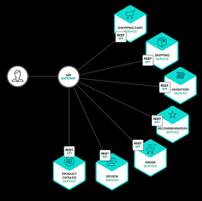

API Gateway plays a vital role in developing, publishing, managing, supervising and securing APIs of any size. It acts as a gateway for applications to access data, business logic, or functionality from backend services. To comprehend API Gateway in its entirety, it is essential to grasp its key aspects.

1. **Request Flow**: The process involves receiving the client's request, verifying their authorization, validating the request, and forwarding it to the appropriate backend integration.

2. **Integration**: The API Gateway routes requests to a backend service after authorization and validation known as the "backing integration." The backend service can be a web service, a serverless function, or any other service.

3. **Response Flow**: Once the backend has completed processing the request, the response is efficiently directed back to the client through API Gateway.

Amazon API Gateway is a fully managed service that supports REST, HTTP, and WebSocket APIs. It offers a range of features including traffic management, authorization and access control, monitoring, and API version management. It also integrates seamlessly with other AWS services such as AWS WAF for enhanced security and AWS X-Ray for performance monitoring. The pricing is based on API requests and data transfer out, and it follows a tiered pricing model that allows for cost reduction as API usage increases

Google Cloud's API Gateway enables secure access to backend services through a REST API that is consistent across all services. It provides features for creating, deploying, and securing APIs, including authentication methods, API configuration, and traffic management.

API Gateway is a crucial component in managing the initial point of entry for client requests to access backend services. It offers a wide array of capabilities to guarantee the security, scalability, and performance of the APIs it oversees.

